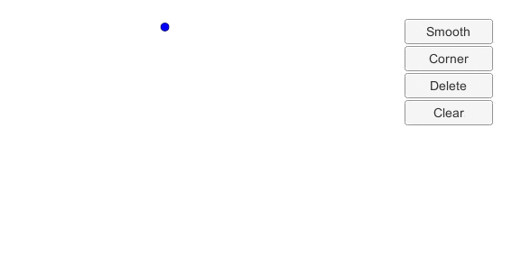

# BezierCanvas 

Unity 上で Illustrator のペンツール風にベジェ曲線を描けるサンプルスクリプトです。[English](https://translate.google.com/translate?sl=ja&tl=en&u=https://github.com/setchi/BezierCanvas) (by Google Translate)

## 開発環境
Unity 2017.1.0f3

## LICENSE
MIT
